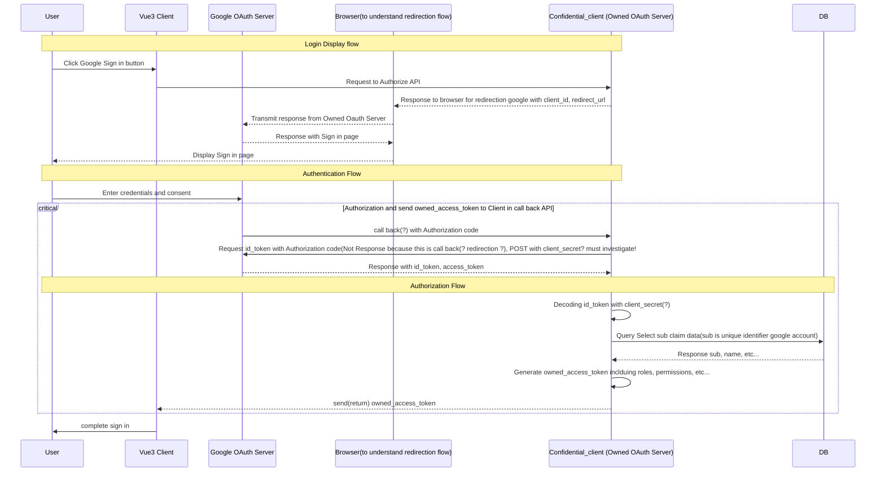

```mermaid

sequenceDiagram
	participant User as User
    participant Client as Vue3 Client
    participant Google as Google OAuth Server
    participant Browser as Browser(to understand redirection flow)
    participant AuthServer as Confidential_client (Owned OAuth Server)
    participant DB as DB

	%% Login Display Flow
	note over User, AuthServer: Login Display flow
	User->>Client: Click Google Sign in button
	Client->>AuthServer: Request to Authorize API
	AuthServer-->>Browser: Response to browser for redirection google with client_id, redirect_url
	Browser-->>Google: Transmit response from Owned Oauth Server
	Google-->>Browser: Response with Sign in page
	Browser-->>User: Display Sign in page

	%% Authentication Flow
	note over User, AuthServer: Authentication Flow
	User->>Google: Enter credentials and consent

	%% Critical proccess
	critical Authorization and send owned_access_token to Client in call back API
	Google->>AuthServer: call back(?) with Authorization code
	AuthServer->>Google: Request id_token with Authorization code(Not Response because this is call back(? redirection ?), POST with client_secret? must investigate!
    Google-->>AuthServer: Response with id_token, access_token
    
	%% Authorization Flow()
	note over DB, User: Authorization Flow
    AuthServer->>AuthServer: Decoding id_token with client_secret(?)
    AuthServer->>DB: Query Select sub claim data(sub is unique identifier google account)
    DB-->>AuthServer: Response sub, name, etc...
    AuthServer->>AuthServer: Generate owned_access_token inclduing roles, permissions, etc...

    AuthServer-->>Client: send(return) owned_access_token
end

%% display main
Client->>User: complete sign in 

```

- owned oauth server에서 응답한 redirection은 브라우저가 식별해서 reidrection의 location인 google oauth server(프론트엔드)에 연결한다
- 이 요청을 인식하면 google oauth server는 브라우저로 응답한다(? 도달할 목적지는?)