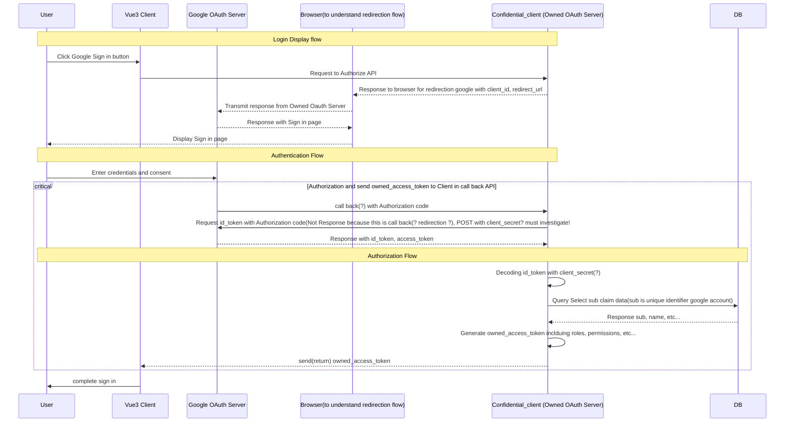

- owned oauth server에서 응답한 redirection은 브라우저가 식별해서 reidrection의 location인 google oauth server(프론트엔드)에 요청한다
- 이 요청을 인식하면 google oauth server는 브라우저로 응답한다. owned oauth server의 연결은 브라우저와의 연결이다. redirection을 브라우저에 건넨걸로 owned oauth server의 역할은 끝났다.
- 그 후부터는 browser와 google oauth server와의 통신이다. localtion URL로 새요청을 보내고 응답을 받는 주체는 오롯이 브라우저다.
- 브라우저가 본다.
- 구글에서 식별하는 것은 client id?
	- 확인했다. client_id를 구글에서 지정한 client_id가 아니라 다른걸로 변경했더니 아래의 에러가 발생했다.
	- 백엔드던 프론트엔드던 client_id로 식별하는것을 확인했다.
- ![[Pasted image 20250513000534.png]]
- 구글은 브라우저에
- public client(BFF를 사용하지 않고)로 google의 OIDC를 해내려면 아래를 참고.
	- https://developers.google.com/identity/gsi/web/guides/overview
	- https://developers.google.com/identity/oauth2/web/guides/overview
- 기본적으로 id token를 안전하게 받는 것(PKCE, 하지만 구글 공식문서에 정확히 안나온다)
- id token을 받은 뒤, 그 id token을 자체인가서버로 보내는 것(post요청 본문)
- id token을 검증하는 것
	- client secret필요할듯?
위의 과정이 전부 지금 명확하지 않다.
- 카카오톡의 OIDC도 참고하자.
	- https://developers.kakao.com/docs/latest/ko/kakaologin/common#oidc
	- https://velog.io/@hunil99/OIDC%EC%99%80-OAuth2.0%EC%9D%84-%EC%82%AC%EC%9A%A9%ED%95%9C-%EC%86%8C%EC%85%9C%EB%A1%9C%EA%B7%B8%EC%9D%B8-%EA%B5%AC%ED%98%841-j5ig6y4s
	- 인가 코드를 백엔드에 전달하네? 
- 공식 OIDC도 참고하자.
	- https://openid.net/developers/how-connect-works/
- 회사 라인 구현코드도 참고하자.

- 인가코드를 백엔드에 전달하네?
- 프론트에서 인가코드만 받는건 안전한건가?
- PKCE는 어떤방식으로?
	- PKCE는 public client의 authorization code를 받는게 탈취당할 위험이 있어서?
	- https://datatracker.ietf.org/doc/html/rfc7636?utm_source=chatgpt.com#section-1.1
	- 구글은 PKCE를 지원하는가?
		- public client에서 authorization code를 받은 뒤, 이를 자체인가서버의 token endpoint에 요청할때포함하는 것으로 클리어 가능
		- 하지만, 구글은 PKCE를 모바일 및 데스크톱앱에 사용하도록 하고 있다....
		- authorization code의 취약점이 Public client에서 발생하는데 이를 해결하려면 PKCE가 필요한데 구글은 웹 애플리케이션에서는 이걸 지원하지 않고 다른 서비스를 사용하라고 하니까 이걸 사용해야겠다.
	- 시퀀스 다이어그램은 authorization code + PKCE로 해놓고, 구글의 다른서비스를 사용하는 걸로 하겠다, 그때 업데이트 하겠다, 로 처리하자.

- token endpoint를 활용하는건 필수다.(자체인가서버를 향해서. 왜냐하면 프론트엔드가 access token을 받아야해.)

https://aodtns.tistory.com/124

https://memoryelim.tistory.com/215